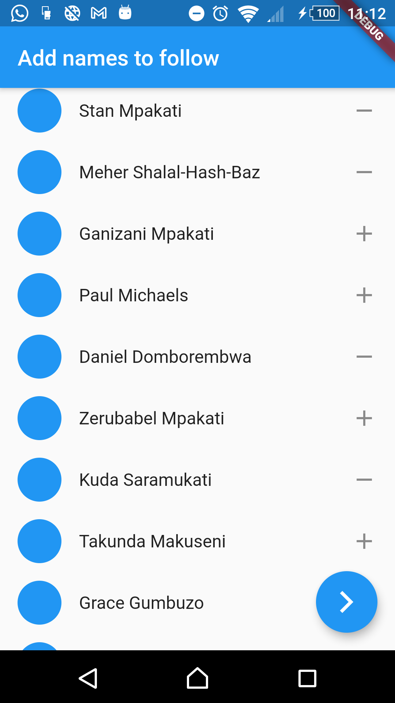

# names_list

A tutorial project for provider

## About

This project is a refresher on the provider
state management solution.

It just shows a basic list of names you can follow
or unfollow buy clicking the +/- icon, this then
updates the followers list which you can view on
another screen

 
